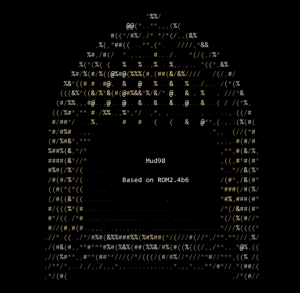
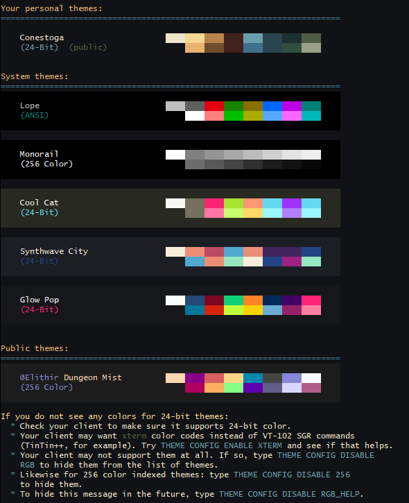
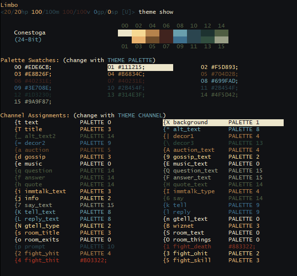

<a name="readme-top"></a>

[![Contributors][contributors-shield]][contributors-url]
[![Issues][issues-shield]][issues-url]
[![MIT License][license-shield]][license-url]

<br />
<div align="center">
  <a href="https://github.com/bfelger/Mud98">
    
  </a>

  <h3 align="center">Mud98 v0.91</h3>

  <p align="center">
    A "new stock" for a classic MUD, updated for a new(ish) millennium
    <!--br />
    <a href="https://github.com/bfelger/Mud98"><strong>Explore the docs »</strong></a-->
    <br />
    <br />
    <a href="https://github.com/bfelger/Mud98/issues">Report Bug</a>
    ·
    <a href="https://github.com/bfelger/Mud98/issues">Request Feature</a>
  </p>
</div>

<details>
  <summary>Table of Contents</summary>
  <ol>
    <li>
      <a href="#about-mud98">About Mud98</a>
    </li>
    <li>
      <a href="#features">Features</a>
      <ul>
        <li><a href="#tls-secure-sockets">TLS Secure Sockets</a></li>
        <li><a href="#mth--mccp--mssp--and-msdp">MTH, MCCP, MSSP, and MSDP</a></li>
        <li><a href="#file-based-configuration">File-based Configuration</a></li>
        <li><a href="#improved-code-quality">Improved Code Quality</a></li>
        <li><a href="#olc-expansion">OLC Expansion</a></li>
        <li><a href="#24-bit-color-themes">24-bit Color Themes</a></li>
      </ul>
    </li>
    <li>
      <a href="#getting-started">Getting Started</a>
    </li>
    <li><a href="#usage">Usage</a></li>
    <!--<li><a href="#roadmap">Roadmap</a></li>-->
    <li><a href="#contributing">Contributing</a></li>
    <li><a href="#license">License</a></li>
    <li><a href="#contact">Contact</a></li>
    <!--<li><a href="#acknowledgments">Acknowledgments</a></li>-->
  </ol>
</details>

## About Mud98

The last official release of Rivers of MUD II (ROM) was 2.4b6, circa 1998. It has been the basis of countless other MUDs over the last couple decades. Over those years, however, it has gotten increasingly more difficult to build with modern compilers without numorous errors and warnings. This project aims to be a viable starting point for future MUDs by updating the code base to modern standards.

Mud98 has the following improvements:

- ROM 2.4b6 base with Lope's ColoUr and OLC 2.1.
- Cross-platform compilation with CMake.
- Builds without errors or warnings in GCC, Clang, MSVC, and Cygwin.
  - Compiles with `-Wall -Werror -Wextra -pedantic`.
- Continuing implementation of modern C (including newer C standards).
- Secure telnet with TLS and password digests provided by OpenSSL.
- User-defined, shareable color themes.

Other than the improvements listed above, Mud98 intends to be true to the spirit of the original ROM as possible; to be a _tabula rasa_ on which other, more modern MUD's can be built.

<p align="right">(<a href="#readme-top">back to top</a>)</p>

## Features

Here are some of the novel improvements to Mud98 over stock ROM:

### Lox Scripting Language

While Mud98 still supports legacy MobProgs, it has a much more powerful alternative: [the Lox scripting language](doc/mud98/lox/index.md). This fast bytecode-interpreted language supports both Object-Oriented and Functional Programming, and is a first-class citizen in Mud98, far beyond what MobProgs was capable of.

### TLS Secure Sockets

OpenSSL provides secure sockets to Mud98. You can configure Mud98 to run TLS in tandem with clear-text telnet, or by itself.

### MTH, MCCP, MSSP, and MSDP

Mud98 implements the MUD Client Compression Protocol (MCCP2 & MCCP3), the MUD Server State Protocol (MSSP), and the MUD Server Data Protocol (MSDP) through Scandum's MUD Telopt Handler (MTH). GMCP is also implemented.

### File-based Configuration

Most settings in Mud98 can be configured in `mud98.cfg`, which resides in the root folder. This includes telnet/TLS settings, MTH/MCCP/MSDP/MSSP settings, file settings, and a growing list of gameplay customization options.

### JSON File support

You can toggle between legacy OLC-formatted area and data files, or JSON via the Jansson library. ([documentation](doc/mud98/json/index.md))

### Improved Code Quality

Part of an on-going effort, Mud98 applies "modern" C best practices to ROM's legacy C code. This is a multi-prong effort:
- Reorganization for smaller, focused code files with an eye toward Single Responsibility Principle.
- Scrupulous application of more constistent (though admittedly opinionated) naming, syntax, and structure.
- Removal of legacy code that is unlikely to ever see usage on modern systems.

### 24-Bit Color Themes

Players can create new color themes and share them publicly with other players. Mud98 supports traditional ANSI, extended 256 color, and 24-bit true color. True color support covers both standard SGR format (Mudlet) and `xterm` format (TinTin++). 

<div>
  <a href="doc/theme-1.png">
  
  </a> <a href="doc/theme-2.png">
  
  </a>
</div>

### Quests

Mud98 has a robust quest system that is tightly integrated with Mob Progs and OLC. Unlike earlier quest systems for ROM, this is a zero-code solution that can be built along with the areas they belong to.

### Multiple-Instance Areas

In Mud98, you can designate whole areas as multiple-instance, which in the parlance of MMORPGs means that players (and their parties) who enter the zone are playing in their own sandbox. This is useful for low-competition starting zones, chatty story-bound NPC's, and whole dungeons spun up just for the player and their friends.

### OLC Expansion

Mud98 adds OLC editors for the following:
- Classes
- Color themes
- Quests

...and more.

<p align="right">(<a href="#readme-top">back to top</a>)</p>

## Documentation

- [Mud98 docs index](doc/mud98/index.md)
- [Project map](doc/mud98/project-map.md)
- [Coding guide](doc/mud98/coding-guide.md)
- [Glossary](doc/mud98/glossary.md)
- [Engineering notes](doc/mud98/engineering-notes.md)
- [Unit test guide](doc/mud98/unit-test-guide.md)

<p align="right">(<a href="#readme-top">back to top</a>)</p>

## Getting Started

You can build and run Mud98 on virtually any desktop or server platform.

### Prerequisites

The following libraries and utilities are required to build Mud98:
* CMake 3.12 or higher.
* Pthreads (Linux, Cygwin)

The following are optional, but **highly** recommended:
* OpenSSL 3.x+.
  - Required for TLS server capability.
* A certificate signed by a legitimate Certificate Authority (if you don't want users getting warnings about self-signed certificates).
* ZLib (for MTH/MCCP/MSDP/MSSP).

### Building Mud98

See the [Getting Started guide](doc/mud98/wb-01-getting-started.md) for in-depth information on how to build on the platform of your choosing.

## Usage

Once Mud98 is built, it can be run from the command-line like so:

```sh
./bin/Mud98
```

Use the `-d` argument to specify the folder to `mud98.cfg` if you don't run it from the base folder.

<p align="right">(<a href="#readme-top">back to top</a>)</p>

<!-- ROADMAP -->
## Roadmap

- [ ] Reload data
  - [x] Help files
  - [X] Rooms
  - [ ] Areas
  - [ ] Other data
- [X] Time-of-day room descriptions
  - [ ] Day-cycle events
- [ ] Professions
  - [ ] Crafting
  - [ ] Resource gathering
- [ ] Randomized areas (dungeons, overland, etc.)
  - [ ] Navigation skills for randomized areas
- [ ] Integrated webserver with embedded MUD-client
- [ ] Loot-pool system
- [ ] Player-run clans/guilds
- [ ] Player/Clan housing
- [ ] Remort system
- [ ] Alternative combat engines

<!--See the [open issues](https://github.com/github_username/repo_name/issues) for a full list of proposed features (and known issues).-->

<p align="right">(<a href="#readme-top">back to top</a>)</p>

## Contributing

Please, please feel free to add this project. Or take it and do something completely different with it. ROM was responsible for my learning to love code in my youth, and I believe it yet has more to teach. Make it your own!

How to contribute:

1. Fork the Project
2. Create your Feature Branch (`git checkout -b feature/AmazingFeature`)
3. Commit your Changes (`git commit -m 'Add some AmazingFeature'`)
4. Push to the Branch (`git push origin feature/AmazingFeature`)
5. Open a Pull Request

<p align="right">(<a href="#readme-top">back to top</a>)</p>

## License

Distributed under the Diku, Merc, and ROM licenses. See `LICENSE.txt` for more information. I make no assumptions as to their enforceability (or even the feasability of compliance); use at your own risk.

<p align="right">(<a href="#readme-top">back to top</a>)</p>

## Contact

Brandon Felger - bfelger@gmail.com

Project Link: [https://github.com/bfelger/Mud98](https://github.com/bfelger/Mud98)

<p align="right">(<a href="#readme-top">back to top</a>)</p>

<!-- ACKNOWLEDGMENTS 
## Acknowledgments

* []()
* []()
* []()

<p align="right">(<a href="#readme-top">back to top</a>)</p-->

<!-- MARKDOWN LINKS & IMAGES -->
<!-- https://www.markdownguide.org/basic-syntax/#reference-style-links -->
[contributors-shield]: https://img.shields.io/github/contributors/bfelger/Mud98.svg?style=for-the-badge
[contributors-url]: https://github.com/bfelger/Mud98/graphs/contributors
[forks-shield]: https://img.shields.io/github/forks/bfelger/Mud98.svg?style=for-the-badge
[forks-url]: https://github.com/bfelger/Mud98/network/members
[stars-shield]: https://img.shields.io/github/stars/bfelger/Mud98.svg?style=for-the-badge
[stars-url]: https://github.com/bfelger/Mud98/stargazers
[issues-shield]: https://img.shields.io/github/issues/bfelger/Mud98.svg?style=for-the-badge
[issues-url]: https://github.com/bfelger/Mud98/issues
[license-shield]: https://img.shields.io/github/license/bfelger/Mud98.svg?style=for-the-badge
[license-url]: https://github.com/bfelger/Mud98/blob/master/LICENSE.txt
